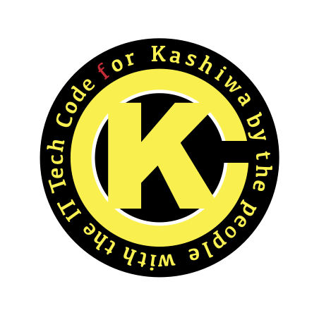

# ksw://Code for Kashiwa

## About Us
私たちは地域や行政のIT化を推進する協働グループです。
複雑化した社会、リアルタイムの対応が求められる社会の中で、地域のIT化が課題になってきていますが、良質なITサービスを実現するには人財・費用が多く求められます。行政や企業だけでは満足度の高いものは作れません。私たちが積極的に参加して、自分たちの意見を「集め」、住民みんなで「作る」ことが求められます。

私たちは住民が自ら行政と協働する「Civic Tech」の概念のもと活動を行います。

### 私たちは知識と技術を共有します
地域のIT化には知識が求められます。プロジェクトに関わる団体や部署の方々やIT技術に興味を持つ方に、基本的な知識や技術を体験を通して共有していきます。

### 私たちは提案します
経験や技術を持った住民・協力者によって、IT化の提案をします。
住民に関わる行政サービスや地域ITサービスなどに関しては、関係各所と協業して、よりユーザビリティの高いものを提供できるように活動を行います。

### 私たちは作ります
柏に住む人、柏に来る人、柏で働く人のために、地域サービスにアクセスしやすいWebシステムやアプリの制作をします。スピードのある対応を行うために独自のサービスを作り、このサービスで集められたデータは、公開し幅広く活用される「オープンデータ」を提供します。

### Civic Techとは？
シビック（Civic：市民）とテック（Tech：テクノロジー）をかけあわせた造語。市民自身が、テクノロジーを活用して、行政サービスの問題やや社会課題を解決する取り組みをいう。

## Our Project

- 新型コロナウイルス質問bot
- テイクアウトマップ柏
